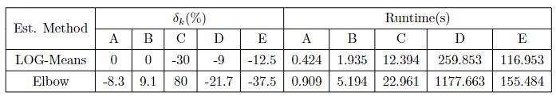

<h1 align="center">LOG-Means</h1>

<div align="center">
  
  
  
  
  
</div>

本项目是根据论文[1] Manuel Fritz, Michael Behringer, Holger Schwarz. LOG-Means: Efficiently Estimating the Number of Clusters in Large Datasets. PVLDB, 13(11): 2118-2131, 2020. DOI: https://doi.org/10.14778/3407790.3407813, 基于C++复现的LOG-Means算法项目。

LOG-Means算法是一种新型、简化的、高效、对大数据集和大搜索空间具有强鲁棒性的簇数目估计方法。它采用了二分搜索策略和递归细化策略，分别在大范围和小范围内进行簇数目估计，从而高效估计数据中的簇的个数。

## 算法实现

- Log-Means算法[1]
  - 定义键值数据结构K和M, K存储k的已评估值和相应的SSE，M存储k的已评估值与k和左侧邻值之间相应的SSE Ratio
  - 当klow和khigh相差大于1（不直接相邻）时，进行迭代
    - 分别对klow和khigh进行KMeans聚类，聚类结果{k, SSE}存储在K中
    - 定义kmid，对kmid进行KMeans聚类，聚类结果{kmid, SSE}存储在K中
    - 分别计算kmid与klow、khigh的SSE Ratio，存储在M中
    - 从M中获取最大的SSE Ratio对应的k值，作为下一次迭代的khigh值
    - 从K中获取khigh的相邻值，作为下一次迭代的klow值
    - 检索klow、khigh对应的SSE作为下一轮迭代的SSEHigh和SSELow

<div align="center">
  
</div>

- k-means||初始化[2]
  - 随机选择一个中心点
  - 计算满足概率条件的多个候选中心点C（可能大于k个）
    - 迭代r次，<del>r=logn</del>(这里设定r=2，Apache Sparch MLLib中的默认值)
    - 根据probability，每次迭代取样O(k)个样本
    - 最后得到大约O(kr)个样本
  - 如果C中的点个数小于k，则继续迭代，直到C中的点个数等于k，然后返回
  - 如果C中的点个数大于k，则进行下一步
    - 给C中所有点赋予权重值，这个权重值表示距离x点最近的点的个数。
    - 使用带有权重的K-Means++算法从C中筛选出k个中心点

<div align="center">
  
</div>

- k-means++初始化
  - 随机选择一个中心点
  - 计算每个点到中心点的距离，选择最远的点作为下一个中心点
  - 重复上述过程，直到选出k个中心点

- random初始化
  - 随机选择k个点作为中心点

- Elbow算法[3]
  - 对于给定的数据集，分别计算k=1,2,...,kmax的KMeans聚类结果
  - 计算每个k对应的SSE
  - 画出k-SSE曲线，选择拐点对应的k值作为簇数目估计值

## 环境需求
- C++编译器（支持C++17或更高版本）
- 第三方库：Eigen3

## 如何使用
- 构建项目
```
./configure
```

- 运行项目
```
// 默认运行模式，对Avila数据集在[0.5c, 2c]范围内进行簇数目估计
./cluster

// 运行帮助
./cluster --help

// 对所有数据集进行簇数目估计
./cluster -a 

// 对指定数据集进行簇数目估计，可以不指定，默认为Avila数据集
./cluster -d <dataset>

// 指定大范围搜索模式，将搜索空间设置为[2, 10c]，默认为[2, 2c]
./cluster -d <dataset> -s

./cluster -a -s
```

## 测试与验证
本项目将使用一系列测试用例对每个模块进行单元测试，以确保它们的正确性和有效性。测试用例应涵盖正常情况、边缘情况和异常情况。此外，我们还将使用一些具有不同特征和规模的真实数据集进行集成测试，以评估算法的性能和准确性。

<div align="center">
  
</div>

每个数据集的规模为：
1. Avila 包含了 10,430 个数据点，每个点有 10 个维度，总计 12 个类
2. DSDD 包含了 58,509 个数据点，每个点有 48 个维度，总计 11 个类
3. MNIST 包含了 60,000 个数据点，每个点有 784 个维度，总计 10 个类
4. KDD 包含了 4,898,431 个数据点，每个点有 34 个维度，总计 23 个类
5. KITSUNE 包含了 20,253,460 个数据点，每个点有 115 个维度，总计 8 个类
6. KITSUNE10 包含了 1,868,224 个数据点，每个点有 115 个维度，总计 8 个类

## 运行结果
### 指标
1. $\delta_k=\frac{k-c}{c}*100\%$ (k是预估类数, c是真实类数)
2. Runtime(s)

### 结果
<div align="center">
  
</div>


## 项目协作者
<a href="https://github.com/PKUcoldkeyboard/LOG-Means/graphs/contributors">
  
</a>

Made with [contrib.rocks](https://contrib.rocks.).

## 许可证
This project is licensed under the Apache 2.0 License. See the LICENSE file for more information.

## 参考文献
[1] Manuel Fritz, Michael Behringer, Holger Schwarz. LOG-Means: Efficiently Estimating the Number of Clusters in Large Datasets. PVLDB, 13(11): 2118-2131, 2020. DOI: https://doi.org/10.14778/3407790.3407813

[2] B. Bahmani, B. Moseley, A. Vattani, R. Kumar, andS. Vassilvitskii. Scalable K-Means++. PVLDB,5(7):622–633, 2012.

[3] R. L. Thorndike. Who belongs in the family? Psychometrika, 18(4):267–276, 12 1953.
